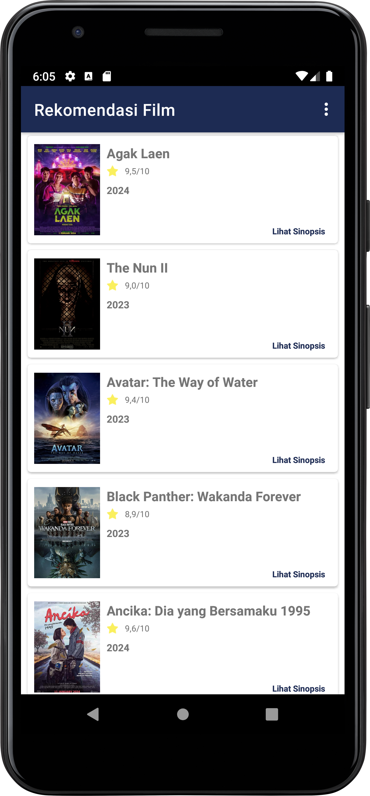
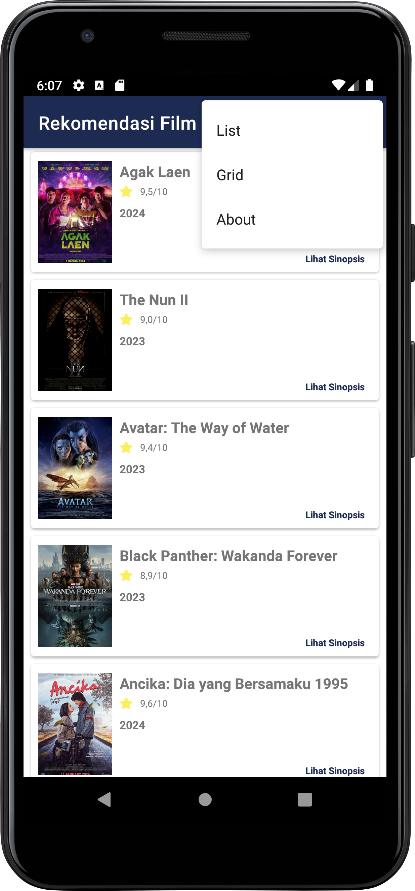
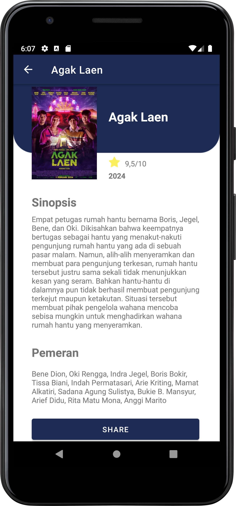
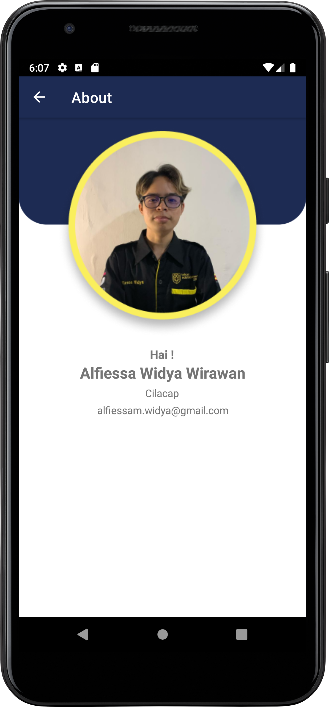

## Belajar Membuat Aplikasi Android untuk Pemula

<p>Submission - Belajar membuat aplikasi android untuk pemula dicoding</p>

## Read This

<p>This repository contains simple applications to fulfill the graduation criteria for the Beginner Android Dicoding class.</p>

## Screenshot





## Features
#### Submission Checklists
- [x] Display splash screen
- [x] Display images and information in the Format list
- [x] A detail page appears when an item is clicked
- [x] Display images and information on the detail page
- [x] Display page about

## Installation
Clone this repository and import into Android Studio
```
https://github.com/AlfiessaWidya/Submission-Akhir-Aplikasi-Android-Sederhana.git
```
## Author
* #### Alfiessa Widya Wirawan
